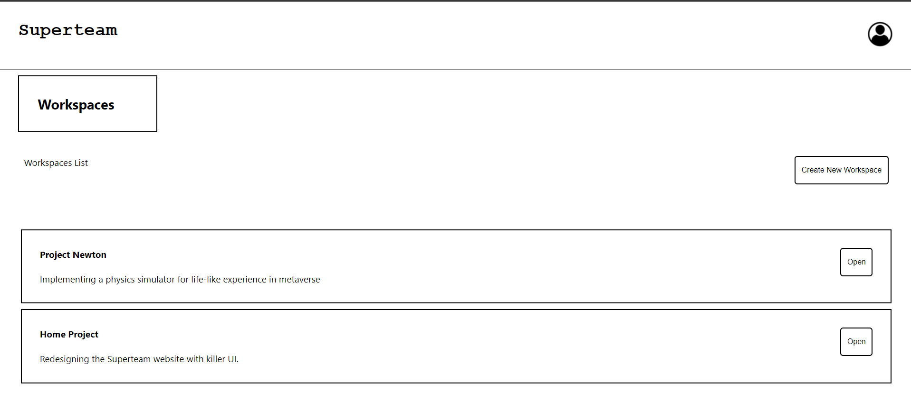

# Superteam Task Manager Application
A small attempt at creating a task management application for Superteam Lurkers Got Talent submission usinf React, Socket.io and Redis.

## Techstack
- Server
  - Nodejs
  - Express
  - Socket.io

- Client
  - Reactjs

- Database
  - Redis

## Folder Structure

- **backend**

Contains all the server side code for maintaing connection with clients and storing the data in database.

- **frontend**

Contains all the client side code for rendering a very simple UI showing the working of the app

## Steps to Execute

1. Make sure you have **Nodejs** and **Redis** installed in your system. We will be connecting to local Redis database that will run in the same system as the server. The properties can be updated to suit your needs.
2. Start the redis server in your local system by executing the `redis-server` command from a terminal. It start listening at port 6379.
3. `cd backend`
4. `npm i && npm start`
5. In a separate terminal, starting from the location of the folder, `cd frontend`
6. `npm i && npm start`
7. Open browser and visit **http://localhost:3000** to view the application.
